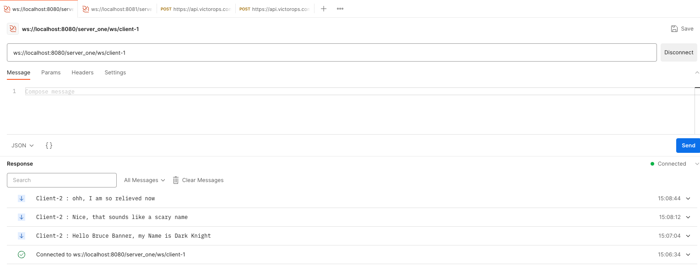
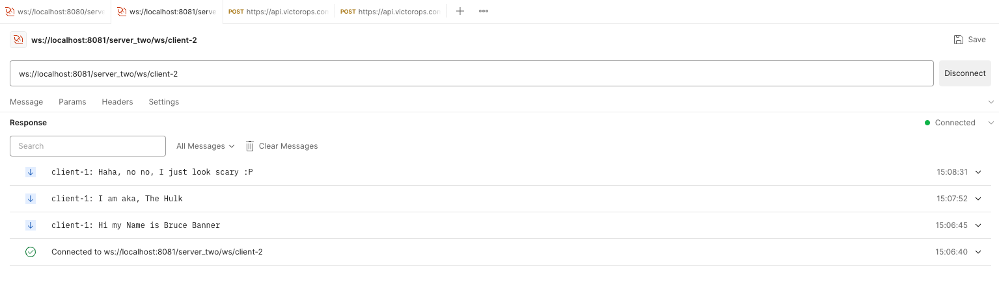

### Motivation
This is a simple implementation of chat application. This utilises websockets in order to maintain 2 way communication.
This is to understand, how we can utilise redis and websockets to create a small chat application.

### Setup need
This needs `Redis`, which acts as a pub/sub. For testing, I have used `PostMan`.
I have used client names as `Client-1` and `Client-2`.
Do not use websocket url as `wss://localhost:8080/server_one/ws/client-1`, as this refers to `secure` websocket connection.

### Screenshots

